# WorkoutApp

android-application

## Table of Contents

- [About](#about)
- [Images](#images)
- [Build](#build)
- [Documentation](#documentation)
- [Licence](#licence)

## About

This application lets the user schedule, log, and track the progression of their exercise and workout sessions conveniently across time.

## Images

### Template Exercise List View (Portrait-Mode)

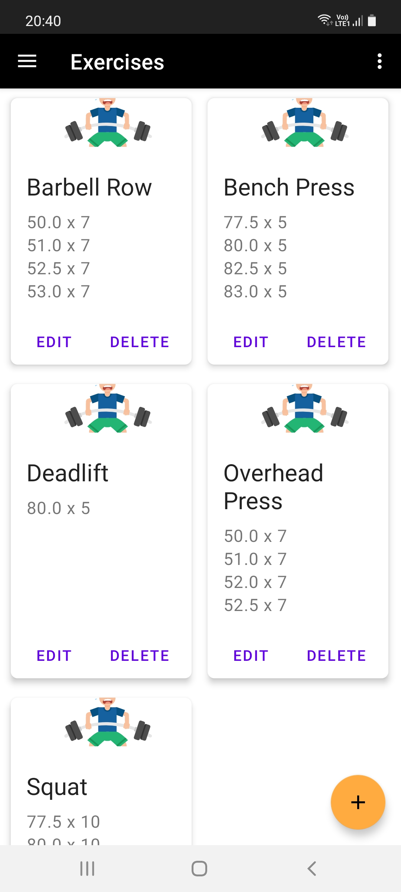

### Template Exercise List View (Landscape-Mode)

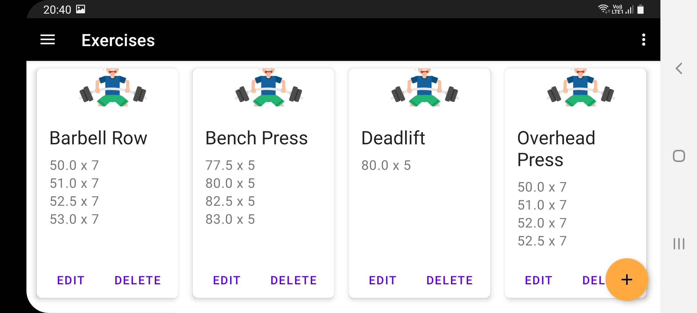

### Exercise Create View (Portrait-Mode)

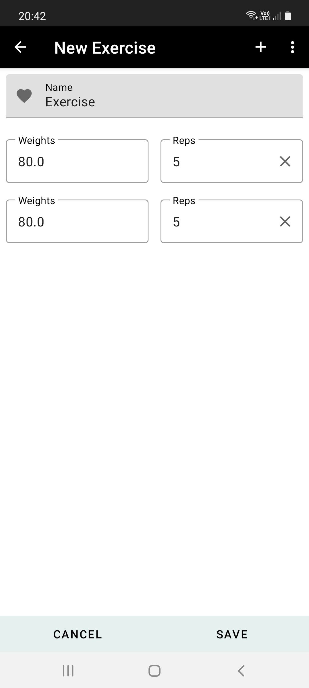

### Exercise Create View (Landscape-Mode)

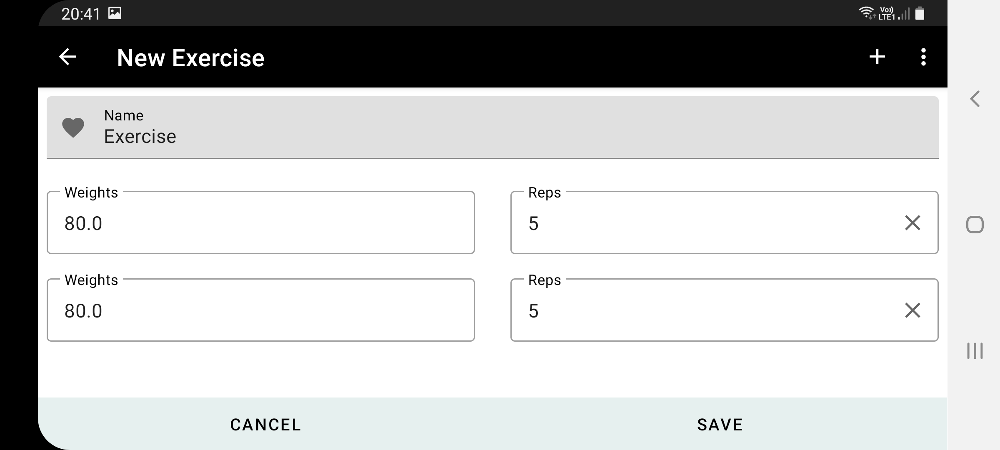

### Workout List View (Portrait-Mode)

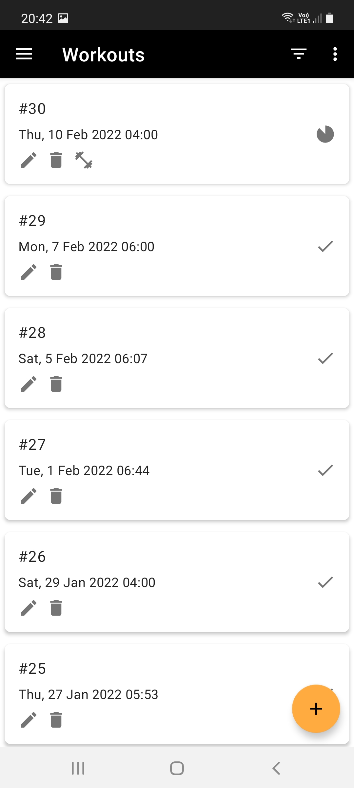

### Workout List View (Landscape-Mode)

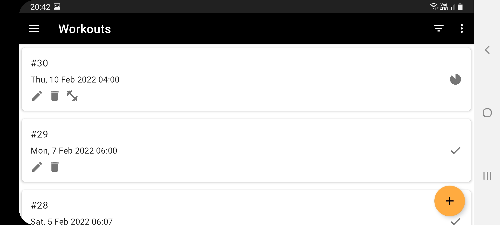

### Workout Create View Date-Picker (Portrait-Mode)

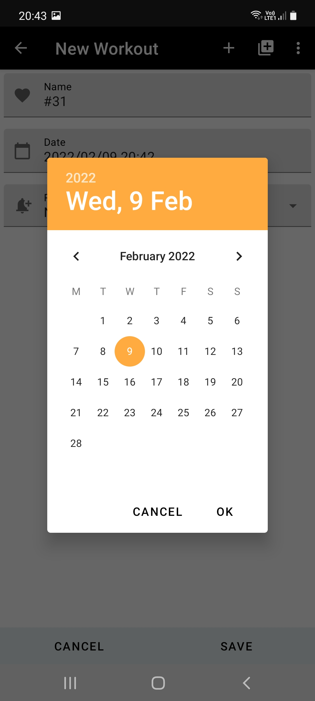

### Workout Create View Time-Picker (Portrait-Mode)

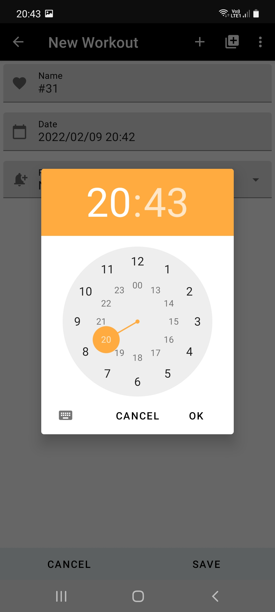

### Exercise Import View (Portrait-Mode)

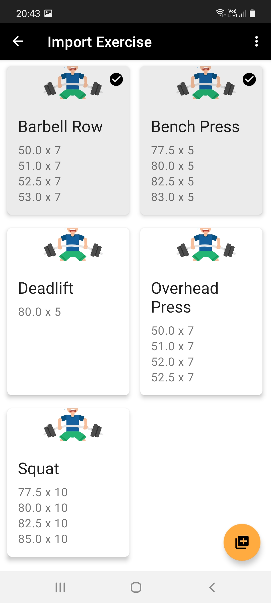

### Exercise Import View (Landscape-Mode)

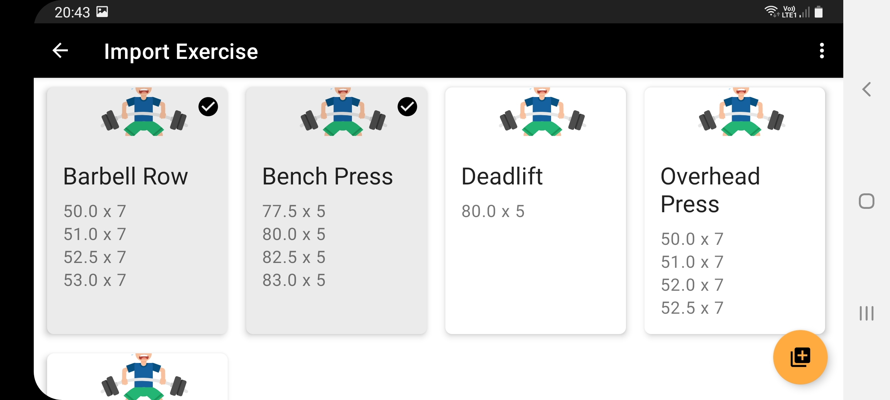

### Workout Create View (Portrait-Mode)

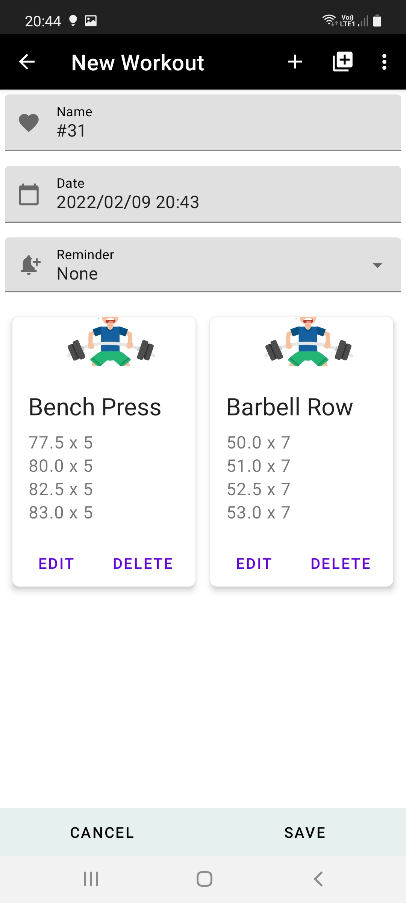

### Workout Details View (Portrait-Mode)

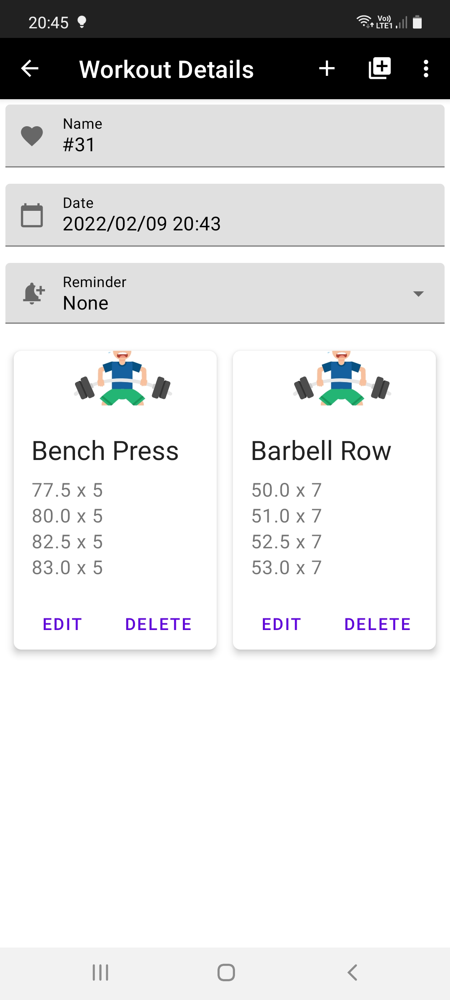

### Workout Session View (Portrait-Mode)

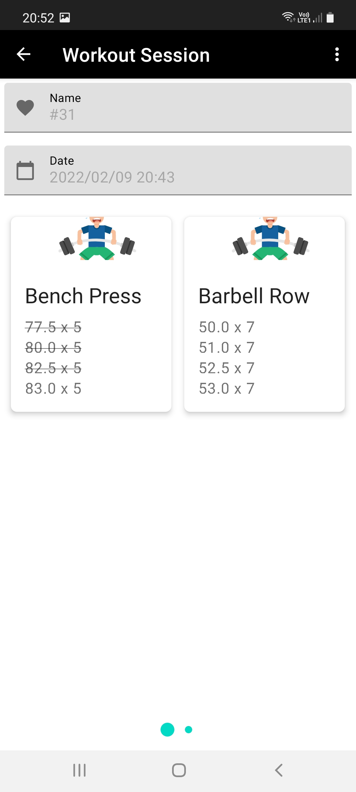

### Workout Session Stopwatch View (Portrait-Mode)

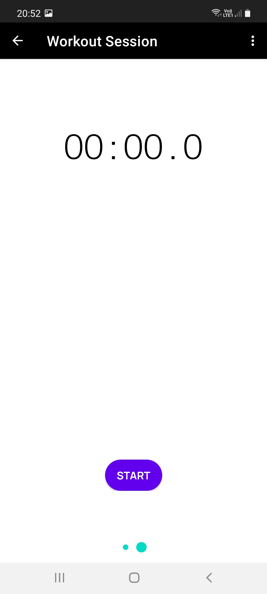

### Progress View (Portrait-Mode)

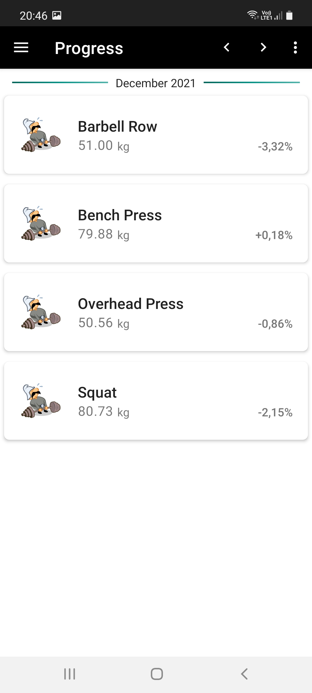

### Progress Details View (Portrait-Mode)

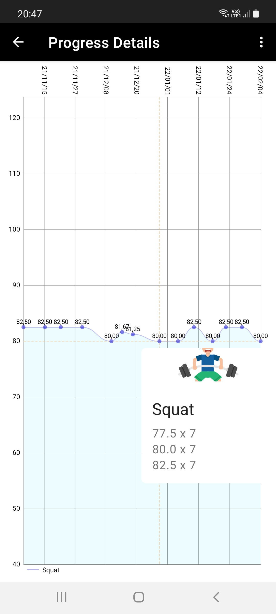

### Navigation Drawer (Portrait-Mode)

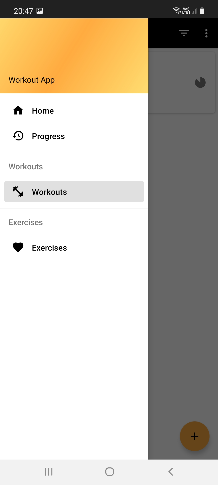

## Build

## Documentation

## Licence
